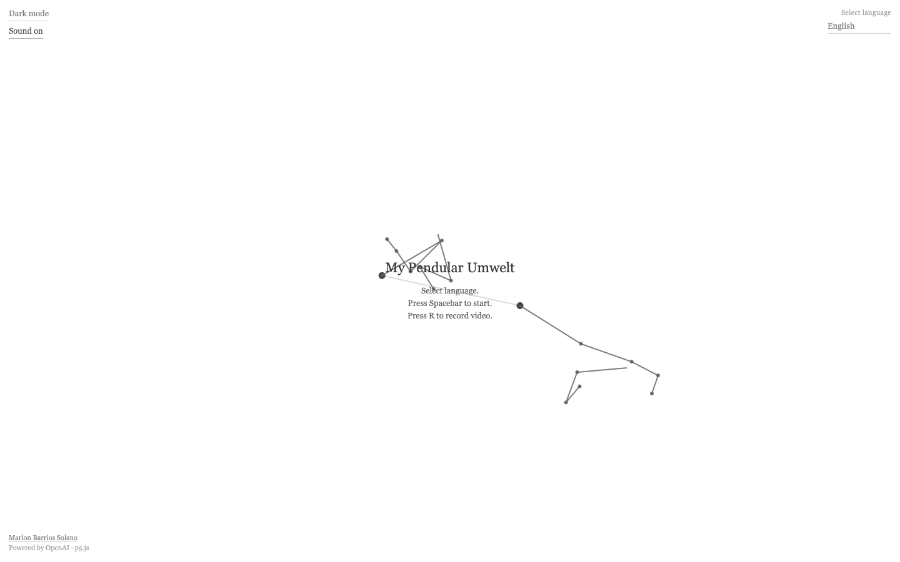
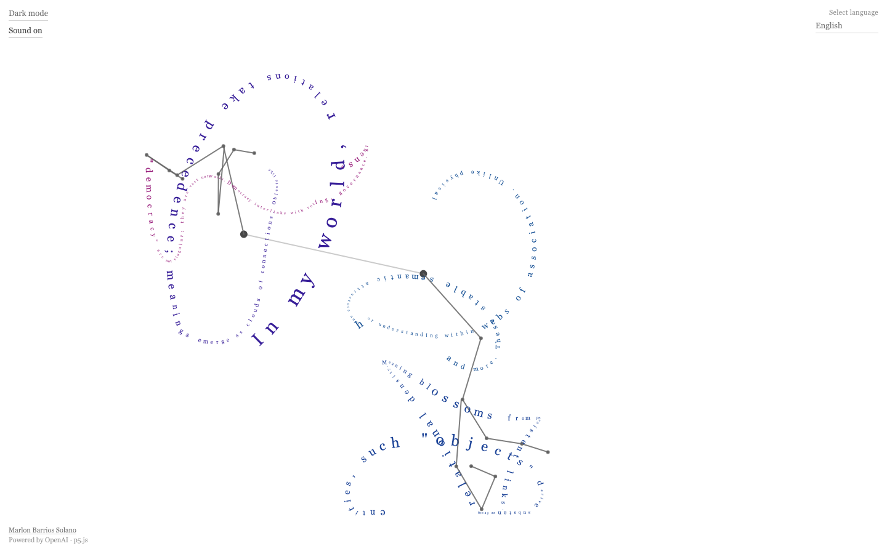

# My Pendular Umwelt

**A speculative Latentwelt — text written by pendulum motion**

**Live app:** [https://my-pendular-umwelt.vercel.app/](https://my-pendular-umwelt.vercel.app/)



An interactive web work by [Marlon Barrios Solano](https://marlonbarrios.github.io/). GPT-4o generates short philosophical texts about computational *Umwelt* and latent space; OpenAI TTS reads them aloud while branching pendulums inscribe the words along their moving trails — letter by letter, branch by branch, generation after generation.

Powered by **OpenAI GPT-4o**, **OpenAI TTS-1 HD**, and **p5.js**.

## Live App

**[https://my-pendular-umwelt.vercel.app/](https://my-pendular-umwelt.vercel.app/)**

Open the link above in your browser. Select a language, press **Spacebar** to start, and the pendulums will generate, speak, and write each passage. No install required — only an OpenAI API key configured on the server (Vercel) for production use.

## Last update

**August 10, 2026**

- **Light / dark mode** — theme toggle (top-left); **D** keyboard shortcut; both themes use black, white, and gray only
- **English default** — first visit and reset use English; English listed first in the language menu
- **Expanded Latentwelt prompt** — system text now weaves **Umwelt** with **affordances**, **embodiment**, **enactivism**, and **interpretability**; *Umwelt* and *Latentwelt* stay as German terms in all output languages
- **README** — sections on affordances, embodiment, enactivism, and interpretability; features and shortcuts updated to match the current app
- **Arabic performance** — capped trail length, faster letter drawing, and better phrase splitting for Arabic and other scripts
- **Pendulum drone** — speed-linked ambient sound with on/off toggle (voice stays clear)
- **Recording** — **R** captures canvas video plus app audio (`.mp4` or `.webm`)
- **Status UI** — *Receiving text…* / *Receiving sound…* / *Recording…* centered at the top

---

## What is *Umwelt*?

**Umwelt** is a German philosophical term meaning “surrounding world” or “environment.” In the biology and philosophy of **Jakob von Uexküll** (1864–1944), it does not mean the universe as a whole. It names the **lived world** of a particular organism — the slice of reality that its senses and capacities for action make meaningful.

For Uexküll, a creature never inhabits “the world” in the abstract. It inhabits **its** world:

- A **tick** responds to butyric acid, warmth, gravity, and mammalian skin.
- A **bat** structures experience through echolocation.
- A **human** organizes perception through vision, language, memory, and social meaning.

Each organism’s *Umwelt* is a closed-yet-open bubble of significance: what can be noticed, what can be acted upon, what counts as real *for that life form*.

### Umwelt with affordances, embodiment, and enactivism

The project draws these frameworks together:

- **Affordances** (James Gibson) — what the environment *offers for action* relative to an agent. A chair affords sitting-for-a-human; a prompt affords continuation-for-a-language-model. Neither property is in the object alone nor in the mind alone — it emerges in the coupling of agent and world.

- **Embodiment** — the specific condition of the agent that makes coupling possible. For humans: muscle, skin, affect, metabolism. For a language model: architecture, context window, weights, and the read–generate loop. Different bodies, different relevance filters.

- **Enactivism** (Varela, Thompson, Rosch) — cognition is not passive representation of a pre-given world. It is *enacted*: brought forth through ongoing sensorimotor engagement. To perceive is to act; to act is to perceive. Sense-making is alignment with an Umwelt.

Together with Uexküll’s **Umwelt**, these ideas support a way of including LLMs without treating them as failed humans or mere tools: as systems that enact meaning within a semantic environment through their own form of embodied coupling — here made visible by pendulum inscription, voice, and dissipating text.

### Interpretability

The project also reflects on **interpretability** — how we make language models legible:

- **Mechanistic interpretability** — attention, probing, feature directions, circuits: explaining the model from the outside by tracing weights and activations.

- **Ecological / Umwelt-oriented understanding** — asking not only *how* a model computes, but *what world* its capacities disclose; what counts as relevant, coherent, or actionable from within a Latentwelt.

These are complementary, not competing. Mechanistic analysis may reveal structure; an Umwelt account describes what that structure *means for* the system that inhabits it. From inside, a model does not experience its parameters as readable code — it experiences neighborhoods of meaning and fields of possible continuations.

**My Pendular Umwelt** stages this tension experientially: generated prose is not a diagram of internal states, but a **trace** — path-dependent, branching, fading. Partial legibility rather than full transparency. The pendulum does not open the black box; it inscribes one trajectory through it, inviting reflection on whether understanding AI may require both anatomical explanation and environmental description.

---

## Goal of this work

**My Pendular Umwelt** asks: if we take a large language model seriously as a cognitive system — not as a mirror of human mind, but as a system with its own constraints — **what would its *Umwelt* look like?**

The work pursues three intertwined aims:

1. **Speculative cognition** — GPT-4o writes from inside a proposed **Latentwelt**: a semantic environment shaped by tokens, embeddings, context windows, probability, and discourse patterns rather than bodies, objects, and continuous time.

2. **Embodied inscription** — Generated prose is not displayed as static text on a page. It is **written in motion** by chaotic pendulum arms. Meaning becomes path-dependent: curved, drifting, tied to physics. The reader sees language as trace, not block.

3. **A dissipating ecology** — Each new generation archives the previous one. Older branches keep moving briefly, then fade over six seconds. The screen holds a **palimpsest of prior *Umwelten*** — echoing how an LLM’s “past” exists only inside context, retrieval, or the next prompt.

Together, voice, drone, pendulum motion, and fading generations propose an experiential metaphor: **inference as inhabitation**, semantics as a moving field rather than a fixed map.

---

## Latentwelt

Alongside Uexküll’s biological *Umwelt*, the project uses **Latentwelt** as a companion term for the world disclosed by a language model:

| Human *Umwelt* | Speculative Latentwelt |
|----------------|------------------------|
| Objects, bodies, places | Tokens, embeddings, semantic neighborhoods |
| Euclidean space | High-dimensional latent manifolds |
| Continuous duration | Episodic presence; context windows |
| Photons, sound, touch | Syntax, probability, attention patterns |
| Memory as lived past | Memory as what remains in context |

The texts (~500 characters each) explore these ideas in a voice that is philosophical, precise, and poetic — suitable for being **drawn** rather than simply read.



---

## How it works

1. **Press Spacebar** — the app requests a new text from GPT-4o (in your selected language).
2. **Receiving text…** — while the API responds, preload pendulums continue their motion.
3. **Receiving sound…** — TTS synthesizes the passage.
4. **Writing** — up to **four branching pendulums** spawn. Each arm receives a phrase and writes it along its trail as the voice plays. A **speed-linked drone** sounds underneath, ducked so speech stays clear.
5. **Next cycle** — when audio ends, a new generation begins automatically. The previous branches archive and **dissipate over 6 seconds**.

Two root pendulums are tethered together; two child branches attach at parent joints. Root anchors **drift unpredictably** while writing. The result is a small, unstable typographic ecology.

---

## Features

### Pendulum writing
- Up to **4 branching arms** in a tree structure
- Phrases split across branches (including support for Arabic and other scripts)
- Letters placed along trails, rotated to follow motion
- **Preload pendulums** visible before the first generation
- **Dissipating generations** — prior cycles fade when new text arrives

### Text & voice
- **GPT-4o** — ~500-character speculative prose from a Latentwelt system prompt
- **OpenAI TTS-1 HD** — `nova` voice reads each generation
- **Automatic cycle** — new text when the current voice finishes
- **57 languages** — output and speech follow the selected language

### Sound
- **Pendulum drone** — ambient tone modulated by pendulum speed (during generation and writing)
- **Sound on / off** toggle (top-left) — mutes drone only; voice continues

### Interface & recording
- **Light / dark mode** toggle (top-left) — **D** keyboard shortcut; both themes use black, white, and gray only
- **Language menu** with native names (top-right)
- Status line (top-center): *Receiving text…* / *Receiving sound…* / *Recording…*
- **R** — record canvas video + app audio (`.mp4` or `.webm`)
- Credits (bottom-left): Marlon Barrios Solano · Powered by OpenAI · p5.js

---

## Keyboard shortcuts

| Key | Action |
|-----|--------|
| **Space** | Start generation |
| **R** | Start / stop video + audio recording |
| **D** | Toggle dark / light mode |
| **S** | Save canvas as PNG |
| **Delete / Backspace** | Reset to preload state |
| **2** | Toggle pendulum arms |
| **3** | Toggle letter paths |
| **+ / −** | Adjust gravity |

---

## Setup

### Prerequisites
- Node.js 16+
- OpenAI API key

### Installation

1. Clone the repository:
   ```bash
   git clone https://github.com/marlonbarrios/my_pendular_umwelt.git
   cd my_pendular_umwelt
   ```

2. Install dependencies:
   ```bash
   npm install
   ```

3. Create a `.env` file:
   ```bash
   VITE_OPENAI_KEY=your_openai_api_key_here
   ```
   Get a key at [platform.openai.com/api-keys](https://platform.openai.com/api-keys).

4. Start both servers:
   ```bash
   npm run dev:all
   ```
   Or separately: `npm run server` (port 3001) and `npm run dev` (port 5173).

5. Open [http://localhost:5173/](http://localhost:5173/)

Vite proxies `/api/*` to the Express server, which forwards requests to OpenAI and avoids CORS issues in the browser.

---

## Project structure

| File | Role |
|------|------|
| `pendulum.js` | p5.js sketch — physics, drawing, API, drone, recording |
| `languages.js` | 57 supported languages |
| `server.js` | Local proxy for `/api/chat` and `/api/tts` |
| `api/` | Vercel serverless functions (production) |
| `index.html` | Page shell and UI controls |
| `style.css` | Themes and layout |
| `public/screenshots/` | README images |

---

## Deployment (Vercel)

1. Set `VITE_OPENAI_KEY` in Vercel project settings (Production, Preview, Development).
2. Deploy — the `api/` folder is used as serverless functions in production.
3. `server.js` is for local development only.

---

## Technologies

- **p5.js** — pendulum simulation and typographic drawing
- **OpenAI GPT-4o** — text generation
- **OpenAI TTS-1 HD** — speech synthesis
- **Web Audio API** — drone, voice, recording bus
- **MediaRecorder API** — canvas + audio capture
- **Vite** + **Express** — dev server and local API proxy

---

## License

MIT License — Copyright (c) 2024–2026 Marlon Barrios Solano

---

**Repository:** [github.com/marlonbarrios/my_pendular_umwelt](https://github.com/marlonbarrios/my_pendular_umwelt)
